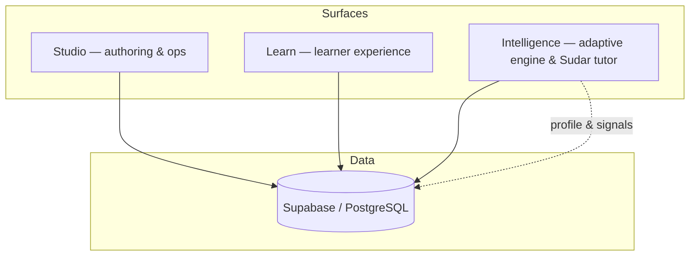

<div align="center">

# Sudar

**The learning platform that actually learns.**

*Learns with you, for you.*

An open-source, **AI-native learning operating system** for teams who need authoring, delivery, and adaptive intelligence in one place — plus **ALP** (Adaptive Learning Protocol) to attach memory-aware tutoring and learner modelling to the LMS you already run.

[**Website & story →**](https://teachwithsudar.com) · [**Research foundation →**](./RESEARCH_FOUNDATION.md) · [**Architecture (start here for code) →**](./ECOSYSTEM.md)

</div>

---

## Why Sudar exists

Most corporate LMSs were built to **deliver content**, not to **learn how each person learns**. The same module goes to everyone; completion is tracked; there is no durable model of the learner, no cross-session tutor memory, and no principled link to decades of cognitive science.

Sudar inverts that: a **Digital Learner Twin** (longitudinal profile), an AI tutor **Sudar** with memory, **seven modalities** from one authored course, and an engine that turns telemetry into next-best actions — while staying **inspectable and forkable** under Apache 2.0.

If you care about *evidence-informed* personalisation, not bolt-on chatbots, you are in the right repo. The capability map is grounded in [RESEARCH_FOUNDATION.md](./RESEARCH_FOUNDATION.md).

---

## What you get in this repository

| | Sudar | Typical LMS + “AI features” |
|--|--------|-----------------------------|
| **Learner model** | Persistent Digital Learner Twin | None or shallow |
| **Tutor** | Sudar — reactive & proactive, cross-session | Often stateless |
| **Delivery** | Text, video, audio, mind map, flashcards, feed, game, SCORM | Often text/video only |
| **Your existing stack** | ALP: APIs & embed paths toward Moodle, Canvas, etc. | N/A |
| **Source** | Open (Apache 2.0) | Usually closed |

**Highlights**

- **Studio** — Author courses with AI assistance, templates, governance, analytics.  
- **Learn** — Learner dashboard, modalities, Sudar tutor, paths, certificates.  
- **Intelligence** — FastAPI service: adaptive sequencing, tutor, next-best-action (optional but recommended).  
- **One Supabase project** — Shared schema so content, events, and twin state stay coherent ([ECOSYSTEM.md](./ECOSYSTEM.md)).

---

## Architecture (four surfaces, one data layer)



| Surface | Role | Default port |
|---------|------|----------------|
| **Sudar Studio** | Courses, paths, assignments, analytics, org settings | 3000 |
| **Sudar Learn** | Enrolment, learning, tutor, progress, certificates | 3001 |
| **Sudar Intelligence** | Adaptive engine, tutor, recommendations | 8000 |

`learning_events` and `ai_interactions` feed the twin and Sudar; Intelligence reads and writes through the same schema as the apps.

---

## Repository layout

Product name is **Sudar**. Folder names `byteos-*` are **legacy** paths (kept for continuity); all user-facing naming is Sudar.

```
Sudar/
├── README.md                 ← You are here (GitHub homepage)
├── ECOSYSTEM.md              ← Schema, roadmap, architecture — read before deep contributions
├── RESEARCH_FOUNDATION.md    ← Evidence base & citations
├── AGENTS.md                 ← Conventions for humans & coding agents
├── docs/                     ← Product, ALP, trust, screenshots, brand (for implementers)
├── byteos-studio/            ← Sudar Studio (Next.js)
├── byteos-learn/             ← Sudar Learn (Next.js)
├── byteos-intelligence/      ← Sudar Intelligence (FastAPI)
├── byteos-video/             ← Optional video pipeline
└── teachwithsudar/           ← Marketing & documentation site (Next.js)
```

---

## Quick start

**Prerequisites:** Node.js 18+, a [Supabase](https://supabase.com) project, and at least one AI provider key (e.g. [Together AI](https://together.ai)).

```bash
git clone https://github.com/Dhanikesh-Karunanithi/Sudar.git
cd Sudar
```

1. **Supabase** — Create a project; align schema with [ECOSYSTEM.md](./ECOSYSTEM.md) (and Prisma in each app where used).  
2. **Studio** — `cd byteos-studio`, copy `.env.example` → `.env.local`, set Supabase + AI keys, `npm install`, `npx prisma db push`, `npm run dev` → http://localhost:3000  
3. **Learn** — `cd byteos-learn`, same pattern → http://localhost:3001  
4. **Intelligence** (optional) — `cd byteos-intelligence`, `pip install -r requirements.txt`, `.env`, `uvicorn src.api.main:app --reload --port 8000`

Marketing site (optional): `cd teachwithsudar`, `npm install`, `npm run dev` (see that package’s README for port).

---

## Documentation map

| Doc | Use when you… |
|-----|------------------|
| [ECOSYSTEM.md](./ECOSYSTEM.md) | Need tables, ports, phases, or “where does this feature live?” |
| [RESEARCH_FOUNDATION.md](./RESEARCH_FOUNDATION.md) | Want the science behind design choices |
| [docs/sudar-memory.md](./docs/sudar-memory.md) | Need tutor / longitudinal memory behaviour |
| [docs/PRODUCT_FEATURES.md](./docs/PRODUCT_FEATURES.md) | Want a feature checklist |
| [AGENTS.md](./AGENTS.md) | Contribute with AI assistants or follow repo contracts |

For **brand implementation** (logo geometry, colours, type), see `docs/brand/` — intended for contributors shipping UI, not the headline story of the project.

---

## Contributing

Issues and PRs aligned with adaptive, memory-aware learning are welcome. Read [ECOSYSTEM.md](./ECOSYSTEM.md) and [AGENTS.md](./AGENTS.md) before large refactors. Fork → branch → PR with a clear description of behaviour and data impact.

---

## License & citation

**License:** [Apache License 2.0](./LICENSE)

**Citation:**

```bibtex
@software{sudar2026,
  author       = {Karunanithi, Dhanikesh and Sudar Contributors},
  title        = {Sudar: An AI-Native Learning Operating System},
  year         = {2026},
  url          = {https://github.com/Dhanikesh-Karunanithi/Sudar},
  note         = {Reference platform and ALP for adaptive, memory-aware learning; see RESEARCH_FOUNDATION.md}
}
```

---

## Creator

**Sudar** is created by **Dhanikesh “Dhani” Karunanithi** — an integrated answer to fragmented authoring tools, static LMSs, and stateless “AI tutors,” with a serious research spine and an open codebase.

<p align="center">
  <strong>Sudar</strong> — Learns with you, for you.
</p>

<p align="center">
  <sub>Apache 2.0 · Open source</sub>
</p>
